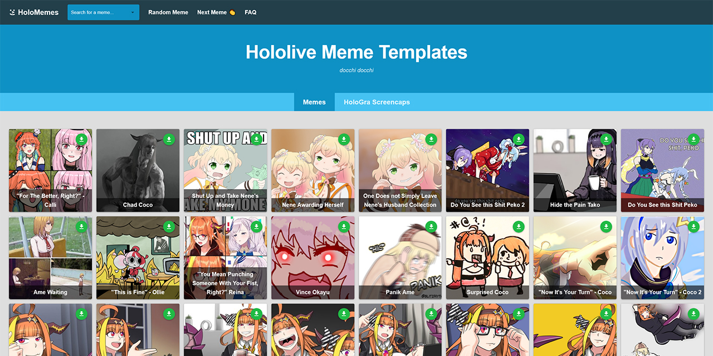

# Blog
* `2021/09/12` <a href="https://www.stephenli.ca/blocking-spam-websites-from-google-search-in-firefox" title="Blocking Spam Websites from Google Search in Firefox" target="_blank">Blocking Spam Websites from Google Search in Firefox</a>
* `2021/09/03` <a href="https://www.stephenli.ca/critical-webpack-resource-injection-for-vue-3-ssr-applications" title="Critical Webpack Resource Injection for Vue 3 SSR Applications" target="_blank">Critical Webpack Resource Injection for Vue 3 SSR Applications</a>
* `2021/07/22` <a href="https://www.stephenli.ca/vuex-4-typescript-declarations-generator" title="Vuex 4 Typescript Declarations Generator" target="_blank">Vuex 4 Typescript Declarations Generator</a>
* `2015/07/22` <a href="https://www.stephenli.ca/finally-a-ray-tracer" title="Finally, A Ray Tracer!" target="_blank">Finally, A Ray Tracer!</a>
* `2015/02/14` <a href="https://www.stephenli.ca/if-x-were-hired-like-programmers" title="If X Were Hired Like Programmers" target="_blank">If X Were Hired Like Programmers</a>
* `2014/02/18` <a href="https://www.stephenli.ca/adventures-of-writing-an-os-kernel-from-scratch-on-a-cortex-m3-board" title="Adventures of Writing an OS Kernel from Scratch on a Cortex M3 Board" target="_blank">Adventures of Writing an OS Kernel from Scratch on a Cortex M3 Board</a>

# Web Apps

<table>

<tr>

<td width="400px" valign="middle"></td>

<td valign="middle">

## <a href="https://simpledex.pages.dev" title="simpledex.pages.dev" target="_blank">SimpleDex</a> 

SimpleDex is a high contrast readonly frontend for browsing MangaDex v5

<code>Typescript</code> <code>Vue.js</code> <code>Progressive Web App</code> <code>Service Worker</code>

</td>

</tr>

<tr>

<td width="400px" valign="middle"></td>

<td valign="middle">

## <a href="https://www.holomemes.moe" title="holomemes.moe" target="_blank">HoloMemes</a>

Hololive meme captioner using HTML5 canvas (Konva.js)

<code>Typescript</code> <code>Vue.js</code> <code>Canvas</code> <code>Docker</code> <code>Nginx</code>

</td>

</tr>

<tr>

<td width="400px" valign="middle"></td>

<td valign="middle">

## <a href="https://www.wowpay2win.com" title="wowpay2win.com" target="_blank">WoWPay2Win</a> 

This tool scans for BoEs in every auction house across each World of Warcraft region

<code>Typescript</code> <code>Vue.js</code> <code>Docker</code> <code>Nginx</code>

</td>

</tr>

<tr>

<td width="400px" valign="middle"></td>

<td valign="middle">

## <a href="https://www.malcovercss.link" title="malcovercss.link" target="_blank">MAL Cover CSS</a> 

Automatically generate CSS to add cover images for your MyAnimeList classic list designs

<code>Typescript</code> <code>Node.js</code> <code>SQLite</code> <code>Express.js</code> <code>Vue.js</code> <code>Docker</code> <code>Nginx</code>

</td>

</tr>

</table>

# Userscripts

<table>

<tr>

<td width="400px" valign="middle"></td>

<td valign="middle">

## Delete Workflow Runs 

Automatically delete old GitHub Action workflow runs

<code>Typescript</code> <code>Vue.js</code>

</td>

</tr>

<tr>

<td width="400px" valign="middle"></td>

<td valign="middle">

## YouTube Playlist Organizer 

Drag and drop interface to organize playlists on YouTube

<code>Typescript</code>

</td>

</tr>

<tr>

<td width="400px" valign="middle"></td>

<td valign="middle">

## GitHub Repository Categories 

Categorize GitHub repositories by matching repository names with regular expressions

<code>Typescript</code> <code>Vue.js</code>

</td>

</tr>

<tr>

<td width="400px" valign="middle"></td>

<td valign="middle">

## WoWProgress Character Page 

Automatically embed WarcraftLogs inside each character's WoWProgress page

<code>Typescript</code> <code>Vue.js</code>

</td>

</tr>

</table>

# Misc. Projects

<table>

<tr>

<td width="400px" valign="middle"></td>

<td valign="middle">

## <a href="https://www.npmjs.com/package/puppeteer-prerender-plugin" title="npmjs.com/package/puppeteer-prerender-plugin" target="_blank">Puppeteer Prerender Plugin</a> 

Webpack 5 plugin for prerendering SPAs with puppeteer

<code>Typescript</code>

</td>

</tr>

<tr>

<td width="400px" valign="middle"></td>

<td valign="middle">

## capted 

C++ Header Library port of APTED algorithm for computing Tree Edit Distance

<code>C++</code>

</td>

</tr>

</table>
